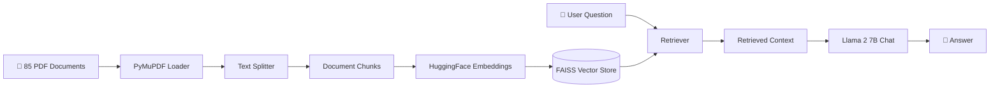

# 🌱 HydroBot - Hydroponics Education Chatbot

An AI-powered chatbot that answers questions about hydroponic farming using Retrieval Augmented Generation (RAG) with Llama 2 and a curated knowledge base of 85 hydroponics-related PDFs.


---

## 📖 Overview

HydroBot is an intelligent question-answering system designed to help users learn about hydroponics. It leverages:

- **85 curated PDF documents** covering various aspects of hydroponic farming
- **Llama 2 7B Chat** as the language model for generating responses
- **FAISS vector store** for efficient semantic search
- **Sentence Transformers** for document embeddings
- **Gradio** for an interactive web interface

---

## 🏗️ Architecture



---

## ✨ Features

| Feature | Description |
|---------|-------------|
| 🔍 **Semantic Search** | Finds the most relevant information from 85 PDFs using vector similarity |
| 🤖 **Llama 2 Integration** | Uses Meta's Llama 2 7B Chat model for accurate, contextual responses |
| 📊 **Efficient Chunking** | Splits documents into 1000-character chunks with 200-char overlap |
| 💾 **Persistent Index** | Saves FAISS index locally for faster subsequent loads |
| 🌐 **Web Interface** | Interactive Gradio UI accessible via browser |
| ⚡ **GPU Accelerated** | Supports CUDA for faster inference |

---

## 🛠️ Tech Stack

| Component | Technology |
|-----------|------------|
| **LLM** | Llama 2 7B Chat (meta-llama/Llama-2-7b-chat-hf) |
| **Embeddings** | sentence-transformers/all-MiniLM-L6-v2 |
| **Vector Store** | FAISS (Facebook AI Similarity Search) |
| **Framework** | LangChain |
| **PDF Parser** | PyMuPDF |
| **UI** | Gradio |
| **Environment** | Kaggle (with T4 GPU) |

---

## 📦 Installation

### Prerequisites
- Python 3.11+
- CUDA-compatible GPU (recommended)
- HuggingFace account with Llama 2 access

### Install Dependencies

```bash
pip install langchain langchain-community transformers sentence-transformers faiss-cpu pypdf huggingface_hub pymupdf gradio
```

> **Note:** Use `faiss-gpu` instead of `faiss-cpu` if you have CUDA available for better performance.

---

## 🔑 Configuration

### HuggingFace Authentication

You need access to Llama 2 model on HuggingFace:

1. Request access at [meta-llama/Llama-2-7b-chat-hf](https://huggingface.co/meta-llama/Llama-2-7b-chat-hf)
2. Create a HuggingFace token
3. Set up authentication:

```python
from huggingface_hub import login
login(token="your_huggingface_token")
```

For Kaggle, use Kaggle Secrets:
```python
from kaggle_secrets import UserSecretsClient
user_secrets = UserSecretsClient()
secret_value = user_secrets.get_secret("llama_for_hydro")
login(token=secret_value)
```

---

## 📂 Project Structure

```
hydrobot/
├── hydrobot-aml.ipynb     # Main notebook
├── faiss_index/           # Saved vector store (generated)
│   ├── index.faiss
│   └── index.pkl
├── data/                  # PDF documents (85 files)
│   ├── hydroponics_guide_1.pdf
│   ├── nutrient_solutions.pdf
│   └── ... (85 PDFs total)
└── README.md
```

---

## 🚀 Usage

### 1. Load and Process PDFs

```python
from langchain.document_loaders import PyMuPDFLoader

pdf_dir = '/path/to/hydroponics/pdfs'
pdf_files = [os.path.join(pdf_dir, f) for f in os.listdir(pdf_dir) if f.endswith('.pdf')]

documents = []
for pdf in pdf_files:
    loader = PyMuPDFLoader(pdf)
    docs = loader.load()
    documents.extend(docs)

print(f"Loaded {len(documents)} pages from {len(pdf_files)} PDFs.")
```

### 2. Create Vector Store

```python
from langchain.text_splitter import RecursiveCharacterTextSplitter
from langchain.embeddings import HuggingFaceEmbeddings
from langchain.vectorstores import FAISS

# Split documents
text_splitter = RecursiveCharacterTextSplitter(
    chunk_size=1000,
    chunk_overlap=200
)
chunks = text_splitter.split_documents(documents)

# Create embeddings and vector store
embeddings = HuggingFaceEmbeddings(
    model_name="sentence-transformers/all-MiniLM-L6-v2",
    model_kwargs={'device': 'cuda'}
)
vector_store = FAISS.from_documents(chunks, embeddings)
vector_store.save_local("faiss_index")
```

### 3. Load LLM and Create QA Chain

```python
from transformers import AutoTokenizer, AutoModelForCausalLM, pipeline
from langchain.llms import HuggingFacePipeline
from langchain.chains import RetrievalQA

# Load Llama 2
model_name = "meta-llama/Llama-2-7b-chat-hf"
tokenizer = AutoTokenizer.from_pretrained(model_name)
model = AutoModelForCausalLM.from_pretrained(
    model_name,
    device_map="auto",
    torch_dtype=torch.float16
)

pipe = pipeline(
    "text-generation",
    model=model,
    tokenizer=tokenizer,
    max_new_tokens=512,
    temperature=0.3,
    top_p=0.90
)

llm = HuggingFacePipeline(pipeline=pipe)

# Create QA chain
qa_chain = RetrievalQA.from_chain_type(
    llm=llm,
    chain_type="stuff",
    retriever=vector_store.as_retriever(search_kwargs={"k": 8}),
    return_source_documents=True
)
```

### 4. Launch Gradio Interface

```python
import gradio as gr

def chatbot(query):
    result = qa_chain({"query": query})
    answer = result["result"]
    if "Answer:" in answer:
        answer = answer.split("Answer:")[-1].strip()
    return answer

iface = gr.Interface(
    fn=chatbot,
    inputs="text",
    outputs="text",
    title="Hydroponics Education Chatbot",
    description="Ask questions about hydroponic farming!"
)

iface.launch(share=True)
```

---

## 💡 Example Questions

| Question | Expected Topic |
|----------|----------------|
| "What is the ideal pH for hydroponic lettuce?" | Nutrient Solutions |
| "How do I set up a deep water culture system?" | System Design |
| "What are common nutrient deficiencies in hydroponics?" | Plant Health |
| "Which plants grow best in hydroponic systems?" | Crop Selection |
| "How often should I change the nutrient solution?" | Maintenance |

---

## ⚙️ Model Parameters

| Parameter | Value | Description |
|-----------|-------|-------------|
| `chunk_size` | 1000 | Characters per document chunk |
| `chunk_overlap` | 200 | Overlap between chunks for context |
| `k` | 8 | Number of retrieved documents |
| `max_new_tokens` | 512 | Maximum tokens in response |
| `temperature` | 0.3 | Low for focused, accurate answers |
| `top_p` | 0.90 | Nucleus sampling threshold |

---

## 📊 Knowledge Base

The chatbot is trained on **85 PDF documents** covering:

- 🌿 Hydroponic system types (NFT, DWC, Ebb & Flow, Aeroponics)
- 🧪 Nutrient solutions and management
- 💡 Lighting requirements (LED, HPS, natural light)
- 🌡️ Environmental control (temperature, humidity, CO2)
- 🌱 Crop-specific growing guides
- 🔧 System setup and maintenance
- 🐛 Pest and disease management
- 📈 Commercial hydroponics operations

---

## 🔧 Troubleshooting

### Common Issues

| Issue | Solution |
|-------|----------|
| `ModuleNotFoundError: langchain.document_loaders` | Use `langchain-community` package |
| CUDA out of memory | Reduce batch size or use CPU |
| Slow inference | Enable GPU or reduce `max_new_tokens` |
| Empty responses | Check PDF loading and chunking |

### Updated Imports (LangChain 0.1+)

```python
from langchain_community.document_loaders import PyMuPDFLoader
from langchain_community.embeddings import HuggingFaceEmbeddings
from langchain_community.vectorstores import FAISS
from langchain_community.llms import HuggingFacePipeline
```

---

## 📋 Requirements

```txt
langchain>=0.1.0
langchain-community>=0.0.1
transformers>=4.35.0
sentence-transformers>=2.2.0
faiss-cpu>=1.7.0
pypdf>=3.0.0
huggingface_hub>=0.19.0
pymupdf>=1.23.0
gradio>=4.0.0
torch>=2.0.0
```

---

## 🤝 Contributing

Contributions are welcome! Feel free to:
- Add more hydroponics PDFs to the knowledge base
- Improve the prompt template
- Optimize retrieval parameters
- Enhance the Gradio UI

---

## 📄 License

This project is for educational purposes. Ensure you have proper access to:
- Llama 2 model (Meta AI license)
- Any copyrighted PDF materials used in the knowledge base

---

## 🙏 Acknowledgments

- **Meta AI** - Llama 2 model
- **LangChain** - RAG framework
- **HuggingFace** - Model hosting and transformers library
- **Facebook Research** - FAISS vector search
- **Gradio** - UI framework

---

<p align="center">
  <b>Built with 💚 for the hydroponics community</b>
</p>
